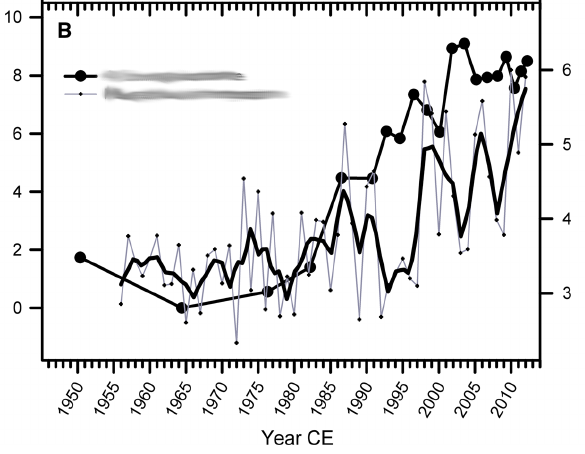

```{r setup, include=FALSE}
options(htmltools.dir.version = FALSE, cache = FALSE)

library("mgcv")
library("ggplot2")
library("cowplot")
theme_set(theme_minimal())
library("tidyr")
d15n_label <- expression(delta^{15} * N) # y-axis label for plot
library("schoenberg")
```

# Funding

.center[]

---
class: inverse
background-image: url('./resources/victor-freitas-548350-unsplash.jpg')
background-size: cover

# Palaeo data *are* time series

**Interest in changes in the data over time &mdash; implies the estimation of trends in data**

Commonly, trend detection involves eye-balling the data

Fundamentally irreproducible &mdash; poor science

Conflates **signal** and **noise** 

.footnote[
<a style="background-color:black;color:white;text-decoration:none;padding:4px 6px;font-family:-apple-system, BlinkMacSystemFont, &quot;San Francisco&quot;, &quot;Helvetica Neue&quot;, Helvetica, Ubuntu, Roboto, Noto, &quot;Segoe UI&quot;, Arial, sans-serif;font-size:12px;font-weight:bold;line-height:1.2;display:inline-block;border-radius:3px" href="https://unsplash.com/@victorfreitas?utm_medium=referral&amp;utm_campaign=photographer-credit&amp;utm_content=creditBadge" target="_blank" rel="noopener noreferrer" title="Download free do whatever you want high-resolution photos from Victor Freitas"><span style="display:inline-block;padding:2px 3px"><svg xmlns="http://www.w3.org/2000/svg" style="height:12px;width:auto;position:relative;vertical-align:middle;top:-1px;fill:white" viewBox="0 0 32 32"><title>unsplash-logo</title><path d="M20.8 18.1c0 2.7-2.2 4.8-4.8 4.8s-4.8-2.1-4.8-4.8c0-2.7 2.2-4.8 4.8-4.8 2.7.1 4.8 2.2 4.8 4.8zm11.2-7.4v14.9c0 2.3-1.9 4.3-4.3 4.3h-23.4c-2.4 0-4.3-1.9-4.3-4.3v-15c0-2.3 1.9-4.3 4.3-4.3h3.7l.8-2.3c.4-1.1 1.7-2 2.9-2h8.6c1.2 0 2.5.9 2.9 2l.8 2.4h3.7c2.4 0 4.3 1.9 4.3 4.3zm-8.6 7.5c0-4.1-3.3-7.5-7.5-7.5-4.1 0-7.5 3.4-7.5 7.5s3.3 7.5 7.5 7.5c4.2-.1 7.5-3.4 7.5-7.5z"></path></svg></span><span style="display:inline-block;padding:2px 3px">Victor Freitas</span></a>
]

---

# Spurious correlation

.pull-left[
**Don't correlate time series**

Known for almost a century this is bad

Non-parametric doesn't mean no assumptions &mdash; still needs i.i.d. data

Only testing for restricted range of trend shapes

- linear (Pearson correlation)
- monotonic (rank correlation)

]

.pull-right[.center[]]

---
background-image: url('./resources/chart.png')
background-size: contain


.footnote[Source: Tyler Viglen [http://www.tylervigen.com/spurious-correlations](http://www.tylervigen.com/spurious-correlations)]

---

# Loess must die

.pull-left[
Loess is a simple scatterplot smoother &mdash; fit is controlled by the *span*

Must choose *span* appropriately

Difficult (impossible?) to do properly&hellip;

As a result often chosen subjectively!

Plain wrong &mdash; don't do it!

Don't use Loess for inference &hellip; exploratory data analysis only
]

.pull-right[


.footnote[Source: [doi: 10/f8gqjj](http://doi.org/10/f8gqjj)]
]

---
class: inverse
background-image: url('resources/ross-findon-303091-unsplash.jpg')
background-size: contain

# What are we to do&hellip;?

.footnote[<a style="background-color:black;color:white;text-decoration:none;padding:4px 6px;font-family:-apple-system, BlinkMacSystemFont, &quot;San Francisco&quot;, &quot;Helvetica Neue&quot;, Helvetica, Ubuntu, Roboto, Noto, &quot;Segoe UI&quot;, Arial, sans-serif;font-size:12px;font-weight:bold;line-height:1.2;display:inline-block;border-radius:3px" href="https://unsplash.com/@rossf?utm_medium=referral&amp;utm_campaign=photographer-credit&amp;utm_content=creditBadge" target="_blank" rel="noopener noreferrer" title="Download free do whatever you want high-resolution photos from Ross Findon"><span style="display:inline-block;padding:2px 3px"><svg xmlns="http://www.w3.org/2000/svg" style="height:12px;width:auto;position:relative;vertical-align:middle;top:-1px;fill:white" viewBox="0 0 32 32"><title>unsplash-logo</title><path d="M20.8 18.1c0 2.7-2.2 4.8-4.8 4.8s-4.8-2.1-4.8-4.8c0-2.7 2.2-4.8 4.8-4.8 2.7.1 4.8 2.2 4.8 4.8zm11.2-7.4v14.9c0 2.3-1.9 4.3-4.3 4.3h-23.4c-2.4 0-4.3-1.9-4.3-4.3v-15c0-2.3 1.9-4.3 4.3-4.3h3.7l.8-2.3c.4-1.1 1.7-2 2.9-2h8.6c1.2 0 2.5.9 2.9 2l.8 2.4h3.7c2.4 0 4.3 1.9 4.3 4.3zm-8.6 7.5c0-4.1-3.3-7.5-7.5-7.5-4.1 0-7.5 3.4-7.5 7.5s3.3 7.5 7.5 7.5c4.2-.1 7.5-3.4 7.5-7.5z"></path></svg></span><span style="display:inline-block;padding:2px 3px">Ross Findon</span></a>]

---
class: inverse
background-image: url(resources/roman-mager-59976-unsplash.jpg)
background-size: contain

# .alpha[Model your data]

.footnote[<a style="background-color:black;color:white;text-decoration:none;padding:4px 6px;font-family:-apple-system, BlinkMacSystemFont, &quot;San Francisco&quot;, &quot;Helvetica Neue&quot;, Helvetica, Ubuntu, Roboto, Noto, &quot;Segoe UI&quot;, Arial, sans-serif;font-size:12px;font-weight:bold;line-height:1.2;display:inline-block;border-radius:3px" href="https://unsplash.com/@roman_lazygeek?utm_medium=referral&amp;utm_campaign=photographer-credit&amp;utm_content=creditBadge" target="_blank" rel="noopener noreferrer" title="Download free do whatever you want high-resolution photos from Roman Mager"><span style="display:inline-block;padding:2px 3px"><svg xmlns="http://www.w3.org/2000/svg" style="height:12px;width:auto;position:relative;vertical-align:middle;top:-1px;fill:white" viewBox="0 0 32 32"><title>unsplash-logo</title><path d="M20.8 18.1c0 2.7-2.2 4.8-4.8 4.8s-4.8-2.1-4.8-4.8c0-2.7 2.2-4.8 4.8-4.8 2.7.1 4.8 2.2 4.8 4.8zm11.2-7.4v14.9c0 2.3-1.9 4.3-4.3 4.3h-23.4c-2.4 0-4.3-1.9-4.3-4.3v-15c0-2.3 1.9-4.3 4.3-4.3h3.7l.8-2.3c.4-1.1 1.7-2 2.9-2h8.6c1.2 0 2.5.9 2.9 2l.8 2.4h3.7c2.4 0 4.3 1.9 4.3 4.3zm-8.6 7.5c0-4.1-3.3-7.5-7.5-7.5-4.1 0-7.5 3.4-7.5 7.5s3.3 7.5 7.5 7.5c4.2-.1 7.5-3.4 7.5-7.5z"></path></svg></span><span style="display:inline-block;padding:2px 3px">Roman Mager</span></a>]

---

# Model your data

Many models available for time series but palaeo data are often unhelpful

1. uneven spacing of observations in time (typically)

2. compaction, variable accumulation rates &rarr; non-constant variance

Can't use typical statistical time series models

**But we can use generalized additive models**

---
class: inverse
background-image: url('./resources/wiggly-things.png')
background-size: contain

---

# GAMs

Linear trend model

$$\mathbb{E}(y_i) = \beta_0 + \beta_1 x_i$$

Generalized Additive Models

$$\mathbb{E}(y_i) = \beta_0 + f(x_i)$$

We assume trend is **smooth**

---

# Splines

.pull-left[
Splines are smooth functions

Made of little basis functions

Estimate $\beta_k$ for each basis function

Sum the weighted basis functions at each time point

Use a penalty on **wiggliness** to avoid over-fitting

]

.pull-right[
```{r basis-functions-1, fig.height = 6, fig.width = 6, echo = FALSE, message = FALSE, cache = TRUE}
small <- readRDS('./resources/small-water-isotope-data.rds')
k <- 7
df <- with(small, data.frame(Year = seq(min(Year), max(Year), length = 200)))
knots <- with(small, list(Year = seq(min(Year), max(Year), length = k)))
sm <- smoothCon(s(Year, k = k, bs = "cr"), data = df, knots = knots)[[1]]$X
colnames(sm) <- levs <- paste0("F", seq_len(k))
basis <- gather(cbind(sm, df), Fun, Value, -Year)
basis <- transform(basis, Fun = factor(Fun, levels = levs))

sm2 <- smoothCon(s(Year, k = k, bs = "cr"), data = small, knots = knots)[[1]]$X
beta <- coef(lm(d15N ~ sm2 - 1, data = small))
scbasis <- sweep(sm, 2L, beta, FUN = "*")
colnames(scbasis) <- levs <- paste0("F", seq_len(k))
fit <- cbind(df, fitted = rowSums(scbasis))
scbasis <- gather(cbind(scbasis, df), Fun, Value, -Year)
scbasis <- transform(scbasis, Fun = factor(Fun, levels = levs))

ylims <- range(basis$Value, scbasis$Value, small$d15N)

p1 <- ggplot(basis, aes(x = Year, y = Value, group = Fun, colour = Fun)) +
    geom_path() +
    scale_x_continuous(breaks = knots$Year, labels = NULL, minor_breaks = NULL) +
    scale_y_continuous(limits = ylims) +
    scale_colour_discrete(name = "Basis Function") +
    theme(legend.position = "none") +
    geom_point(data = small, mapping = aes(x = Year, y = d15N), inherit.aes = FALSE, size = 2, colour = "grey70") +
    labs(y = d15n_label, x = "Year CE (Knots)")

p2 <- ggplot(scbasis, aes(x = Year, y = Value, group = Fun, colour = Fun)) +
    geom_path() +
    scale_x_continuous(breaks = knots$Year, labels = NULL, minor_breaks = NULL) +
    scale_y_continuous(limits = ylims) +
    scale_colour_discrete(name = "Basis Function") +
    theme(legend.position = "none") +
    geom_point(data = small, mapping = aes(x = Year, y = d15N), inherit.aes = FALSE, size = 2, colour = "grey70") +
    geom_line(data = fit, mapping = aes(x = Year, y = fitted), inherit.aes = FALSE,
              size = 0.75, colour = "black") +
    labs(y = d15n_label, x = "Year CE (Knots)")

pbasis <- plot_grid(p1, p2, ncol = 1, align = "hv", labels = "auto")
pbasis
```
]

---

# Braya-S&oslash;

Alkenone unsaturation index &mdash; temperature interpretation

.center[
```{r braya-so-data, fig.width = 9, fig.height = 3.5, cache = FALSE, echo = FALSE, dpi = 150}
## load braya so data set
braya <- read.table("./resources/DAndrea.2011.Lake Braya So.txt",
skip = 84)
names(braya) <- c("Depth", "DepthUpper", "DepthLower", "Year", "YearYoung",
"YearOld", "UK37")
braya <- transform(braya, sampleInterval = YearYoung - YearOld,
                   YearBP = 1950 - Year, negYearBP = - (1950-Year))
braya_ylabel <- expression(italic(U)[37]^{italic(k)})

## Generate a plot of the data
braya_plt <- ggplot(braya, aes(x = YearBP, y = UK37)) +
    geom_line(colour = "grey", size = 0.75) +
    geom_point(size = 2) +
    labs(y = braya_ylabel, x = "Year BP") +
    scale_x_reverse() +
    theme(text = element_text(size = 18))

braya_plt
```
]

.footnote[D’Andrea, *et al* (2011). PNAS *108*: 9765&ndash;9769. [doi: 10/brnm2n](https://doi.org/10.1073/pnas.1101708108)]

---

# Braya-S&oslash; &mdash; estimated trend

We get some wiggles &mdash; but which are real?

```{r braya-fitted-gam, cache = FALSE, echo = FALSE}
bmod <- gam(UK37 ~ s(negYearBP, k = 45), data = braya, method = "REML",
            weights = sampleInterval / mean(sampleInterval))
newBraya <- with(braya,
                 data.frame(Year = seq(min(Year), max(Year), length.out = 500)))
newBraya <- transform(newBraya, YearBP = 1950 - Year,
                                negYearBP = - (1950 - Year))
braya_pred <- cbind(newBraya, data.frame(predict(bmod, newBraya,
                                                 se.fit = TRUE)))
braya_pred <- transform(braya_pred, upper = fit + (2 * se.fit),
                                    lower = fit - (2 * se.fit)) 
```

```{r braya-fitted-gam-plot, fig.width = 9, fig.height = 3.5, cache = FALSE, echo = FALSE, dpi = 150}
ggplot(braya, aes(y = UK37, x = YearBP)) +
    geom_point() +
    geom_ribbon(data = braya_pred,
                mapping = aes(x = YearBP, ymax = upper, ymin = lower),
                alpha = 0.3, inherit.aes = FALSE) +
    geom_line(data = braya_pred, mapping = aes(y = fit, x = YearBP)) +
    labs(y = braya_ylabel, x = "Year BP") +
    scale_x_reverse() +
    theme(text = element_text(size = 18))
```

---

# Calculus FTW!

Compute the first derivative of the spline and it's uncertainty

* Where confidence band *includes* **0** we fail reject the H<sub>0</sub> of *no change*
* Where *doesn't* include **0** we reject H<sub>0</sub> &rarr; conclude there's change

```{r ref.label = "braya-fitted-gam-plot", fig.width = 9, fig.height = 3.5, cache = FALSE, echo = FALSE, dpi = 150}
```

---

# Braya-S&oslash; rates of change

```{r braya-derivatives, echo = FALSE}
braya.d <- fderiv(bmod, newdata = newBraya, n = N)
braya.sint <- with(newBraya, cbind(confint(braya.d, nsim = 1000, type = "simultaneous"), Year = Year, YearBP = 1950 - Year))
```

```{r braya-derivatives-plot, fig.width = 9, fig.height = 3.5, cache = FALSE, echo = FALSE, dpi = 150}
ggplot(braya.sint, aes(x = YearBP, y = est)) +
    geom_ribbon(aes(ymin = lower, ymax = upper), alpha = 0.2, fill = "black") +
    geom_line() +
    labs(x = "Year BP", y = "First derivative") +
    scale_x_reverse() +
    theme(text = element_text(size = 18))
```

---

# What else&hellip;?

Once you start to think in terms of models you can address problems out of reach previously:

* *models for mean and variance* &mdash; resilience & tipping points (?)
* *account for age-model uncertainty*
* *compare trends across multiple sites*
* &hellip;

---

# Lake 227: eutrophication &rarr; increased variance

.pull-left[
.center[**Trend in mean**]

]

.pull-right[
.center[**Trend in variance**]
]

---

# Conclusions

Most palaeolimnological data are time series & we're interested in estimating trends in those data

But, we rarely try to estimate those trends statistically

When we do, we often do it inappropriately

We should be modelling our data using statistical models

GAMs are a (relatively) simple model that we could use to model palaeo time series

---

# Want to know more&hellip;?

.pull-left[
Preprint &mdash; [doi: 10/cq5k](https://10/cq5k)

Blog &mdash; [www.fromthebottomoftheheap.net](https://fromthebottomoftheheap.net)

Slides &mdash; [bit.ly/ipagams](http://bit.ly/ipagams)
]

.pull-right[.center[]]

